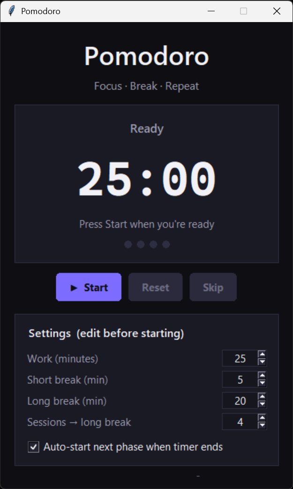
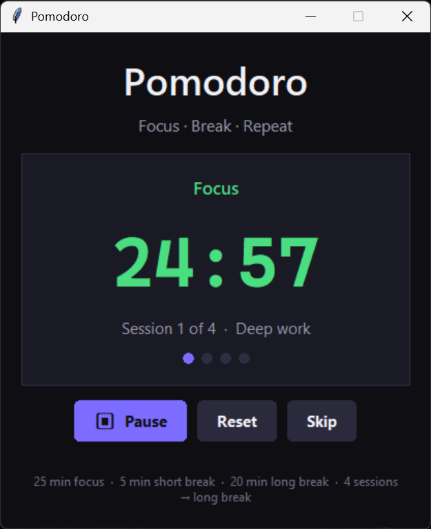

# Pomodoro Timer

<div align="center">
  
  
</div>

A modern desktop Pomodoro timer built with pure Python and Tkinter.  
No extra packages — just the standard library.

---

## Download (Windows)

**No Python required.** Download the ready-to-run executable:

➡️ **[Download Pomodoro.exe](https://drive.google.com/file/d/16O4GgoBgJoenMfZkl88dHrLCJmN-UPNQ/view?usp=drive_link)**

Download, double-click, and start focusing.

---

## Features

- **Editable settings** before you start
  - Work duration
  - Short break
  - Long break
  - Sessions until long break
  - Auto-start next phase (on/off)

- **Settings hide while running** — window height shrinks to fit; settings return on Reset

- **Notifications**
  - Sound when a phase ends (Windows / macOS / Linux)
  - Priority popup on top of other apps with session info and what’s next

- **Controls**
  - Start / Pause / Resume
  - Reset
  - Skip current phase

- **Visual**
  - Dark theme
  - Scales to your screen size
  - Rounded buttons
  - Monospace timer font
  - Session progress dots
  - Phase-colored timer text

---

## Requirements

### Option A — Use the executable (easiest)

- Windows only
- No Python needed

### Option B — Run from source

- Python 3.8 or higher
- Tkinter (included with most Python installs)

**Linux** — if Tkinter is missing:

```bash
sudo apt install python3-tk
```

---

## Run from source

```bash
python main.py
```

---

## Default cycle

| Phase                 | Default |
| --------------------- | ------- |
| Focus                 | 25 min  |
| Short break           | 5 min   |
| Long break            | 20 min  |
| Sessions → long break | 4       |

Change any of these in the Settings panel before pressing **Start**.

---

## How it works

1. Set your times and session count (optional).
2. Choose whether the next phase should start automatically.
3. Press **Start**.
4. When a phase ends: sound + popup appear.
5. Press **Reset** anytime to stop and edit settings again.

---

## License

MIT
